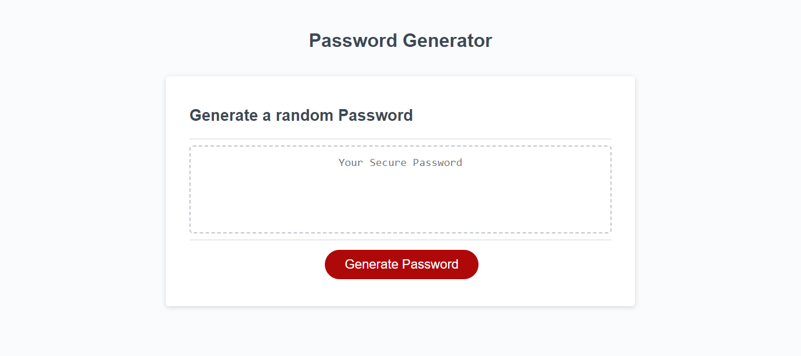

# password-generator
Effortlessly generate strong and secure passwords with advanced password generator for enhanced online security.

# Links
https://rashid-subhani.github.io/password-generator/
https://github.com/rashid-subhani/password-generator

screenshot link:

This repository contains a simple password generator implemented in JavaScript. The generator allows users to customize their passwords based on various criteria, including password length and the inclusion of special characters, numeric characters, lowercase characters, and uppercase characters.

# Files
index.html: The HTML file provides the structure for the password generator user interface.

style.css: The CSS file contains styles to enhance the visual appeal of the password generator user interface.

script.js: The JavaScript file contains the logic for the password generator. It includes arrays of special characters, numeric characters, lowercase characters, and uppercase characters. The script also defines functions for generating random elements from an array and prompting users for password options.

# How to use
Open index.html in a web browser.

Click the "Generate Password" button.

Follow the prompts to customize the password based on desired length and character sets.

The generated password will be displayed in the designated textarea.

# Acknowledgments
The password generator logic is based on the provided pseudocode and includes additional improvements for user customization.
Feel free to contribute to the project by opening issues or submitting pull requests. Thank you for using the Password Generator!

